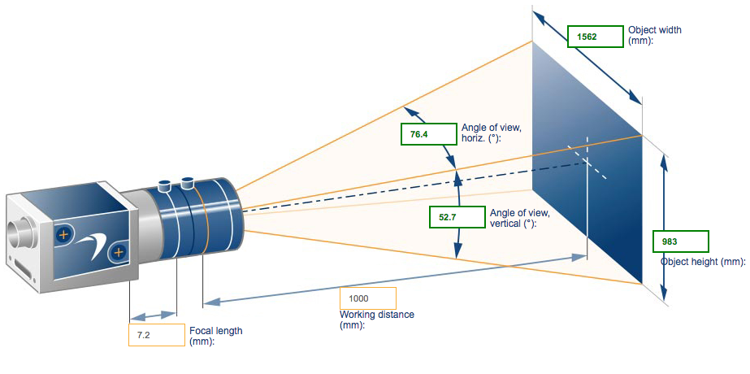

## Selecting the correct lens

Fisheye lenses are not good for obstacle detection. Images captured by fisheye lenses are highly distorted and due to that good disparity maps are hard to obtain which is the starting step for obstacle detection using stereo vision. Ideally it is essential to have a lens wide enough to cover the entire width of the robot at a reasonable distance in front of the robot.

It is essential that the lens format must be bigger than the sensor (camera) format so that there is no vignetting. The current cameras on the Jackal are two **PointGrey 1/1.2" IMX249**. Hence the lens format should be bigger than 1/1.2".

The best lens that suits our need right now is the **KOWA LM6HC F1.8 f6mm 1"**. Since it's format is 1", it's apparent focal length on the 1/1.2" camera is 7.2mm. The following image shows the resulting FOVs.

