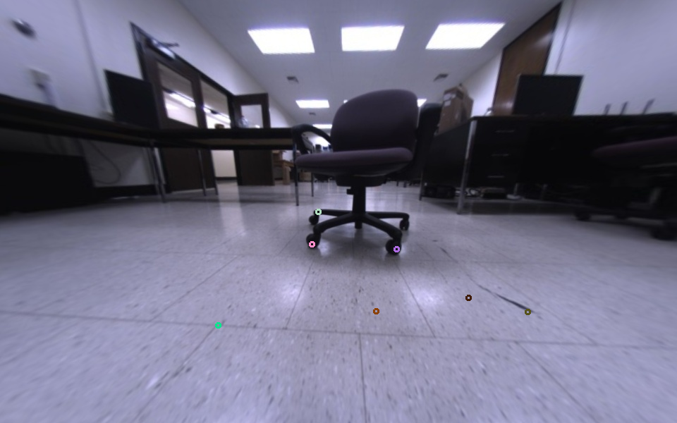
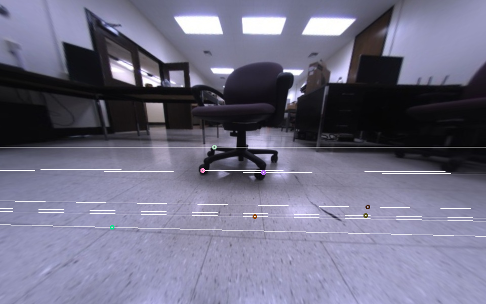
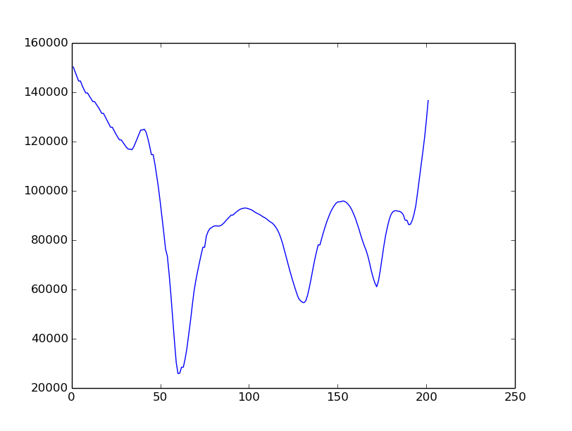
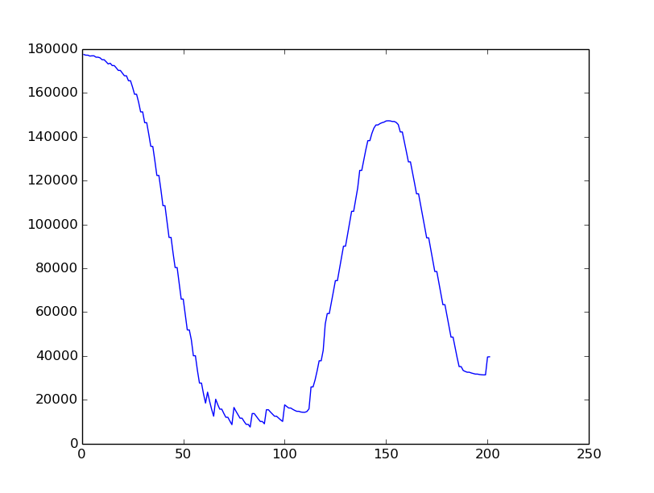

## Disparity Maps

Given a pair of stereo images, for every point in the left image there is a corresponding epipolar line in the right image. The correspondence of that point lies on the epipolar line.

The correspondence is searched using a window based similarity/dissimilarity approach. The shift in x-coordinate of the point is known as disparity and disparity values for all such points make up a disparity map. Now generating smooth dense disparity maps is in itself a very challenging problem. Due to noise, occlusion etc. smooth disparity maps are very hard to obtain, so often post processing techniques are employed to obtain smooth maps. These methods are often computationally expensive and take a lot of time.

Therefore for obstacle avoidance it is better to stick to local methods for computing disparity instead of opting for global optimizing techniques. Local methods include window based matching by using cost functions such as SAD, SSD, NCC etc.

Now for local obstacle avoidance, it is not required to calculate disparity values for all points because many points in the image lie outside the region in front of the robot. Also only a part of the epipolar line needs to be checked to find each correspondence. This improves computation time drastically.

However due to noise in the images, local methods don't tend to give good results especially in textureless regions. Consider the following pairs of images.

|Left Image                           |Right Image                           |
|:-----------------------------------:|:------------------------------------:|
|||

The above left and right images are the undistorted images taken from a fisheye lens. The small circles are in the left image are the points whose correspondences are to be searched in the right image. The lines in the right image are the epipolar lines for each of those points in the left image. The points marked at the foot of the chair are correctly matched whereas some of the points in the floor have incorrect correspondences. The two graphs below explain why that is.

|Good Correspondence Match |Bad Correspondence Match |
|:------------------------:|:-----------------------:|
|||

The matching method or the cost function used for the matching shown here is SAD (sum of absolute differences). A good correspondence match has a clear local minimum whereas a bad correspondence has multiple minima and hence the confidence value for the disparity is low.

Although this example is for the fisheye lens but there isn't significant improvement on the ground plane matching by normal wide angle lenses too.

## Efficient Large Scale Stereo (ELAS)
