### AMRL INDOORS

#### Static Objects

|S.No. |Scene |Actual distance |Observed distance |Pipeline       |Total time         |Confidence |
|:----:|:----:|:--------------:|:----------------:|:-------------:|:-----------------:|:---------:|
|1.    |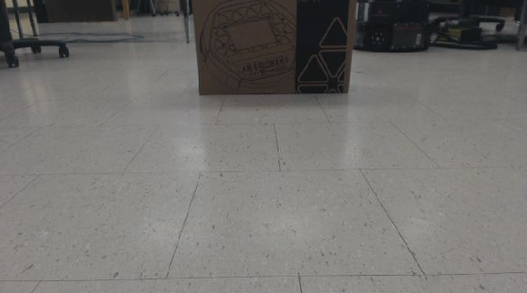|1.60             |1.53              |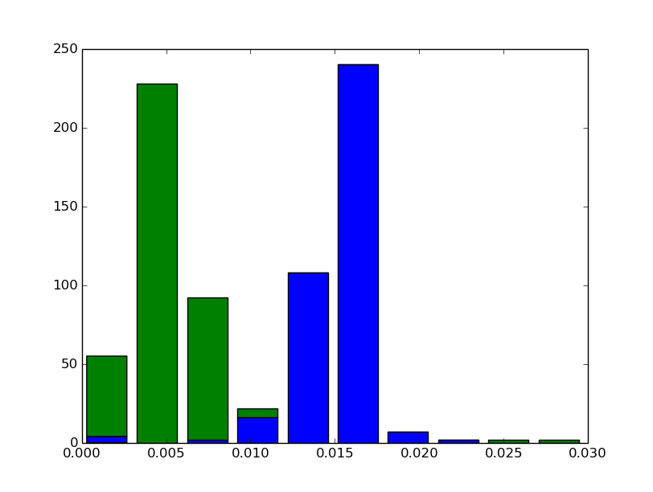|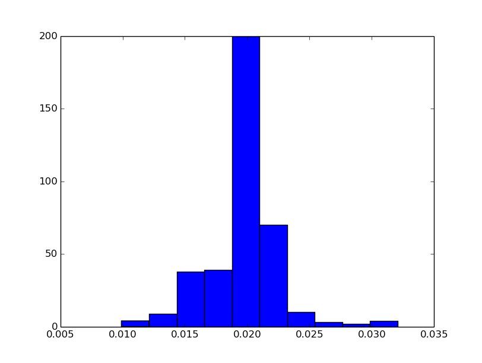|1.00|
|2.    |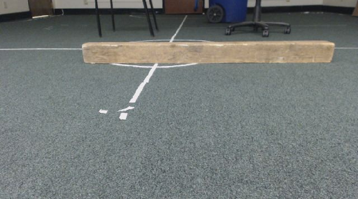|1.58             |1.56              |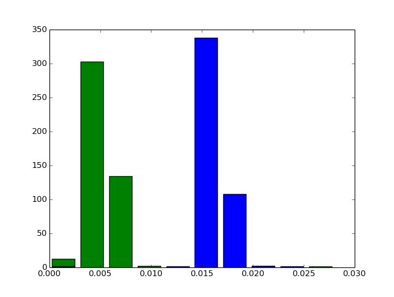|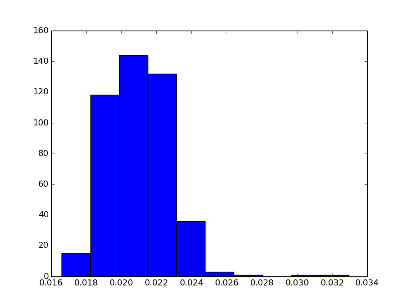|1.00|
|3.    |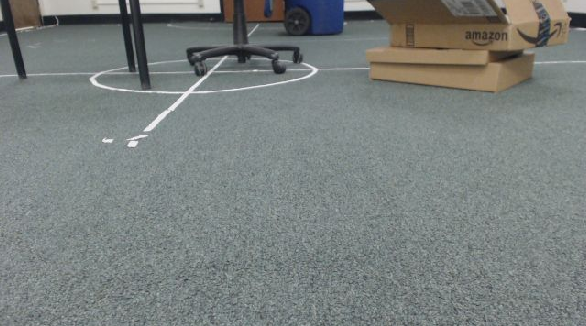|1.53             |1.50              |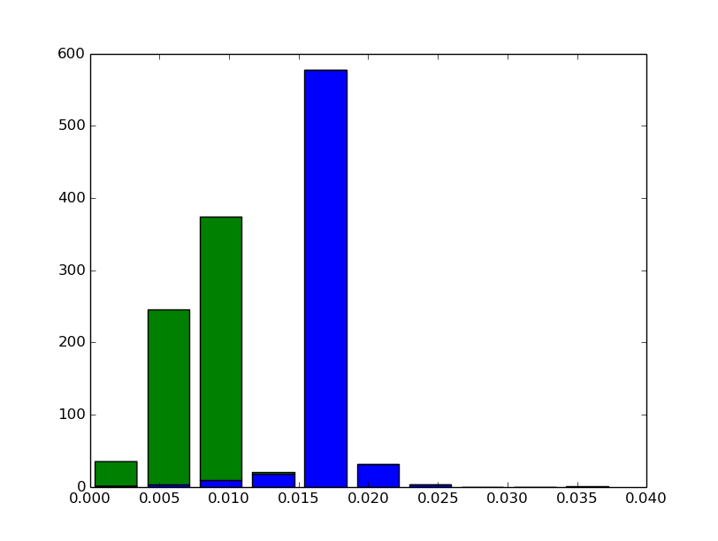|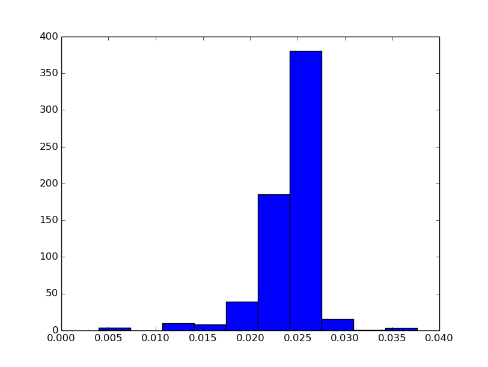|0.50|
|4.    |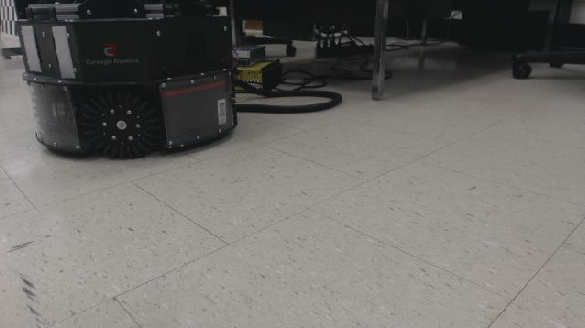|1.20             |1.19              |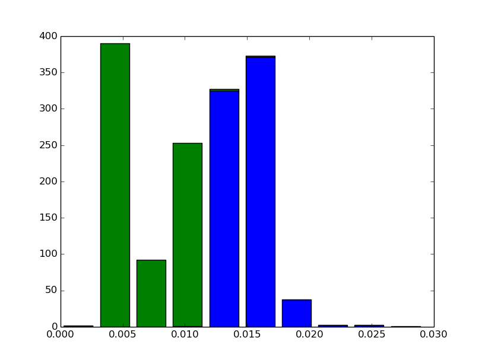|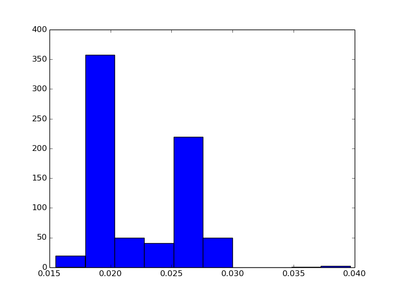|1.00|
|5.    |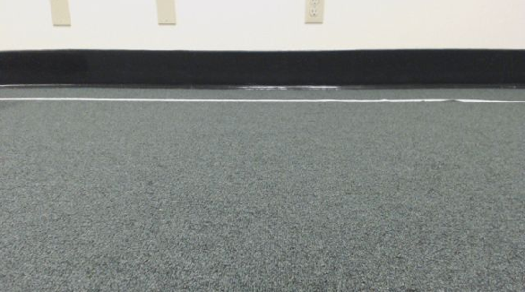|1.82             |1.58              |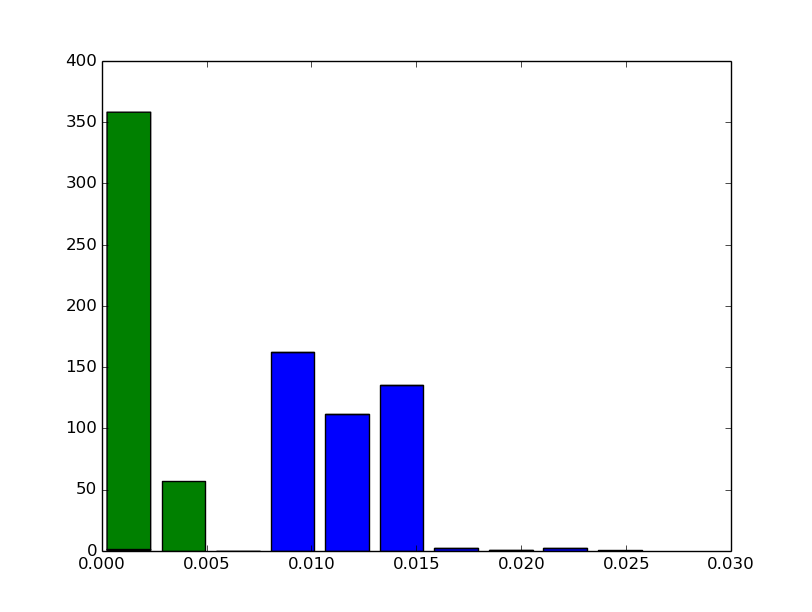|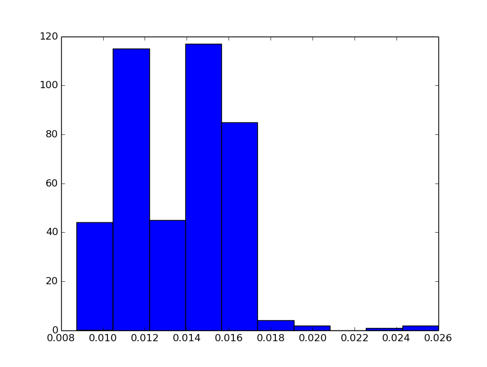|0.45|
